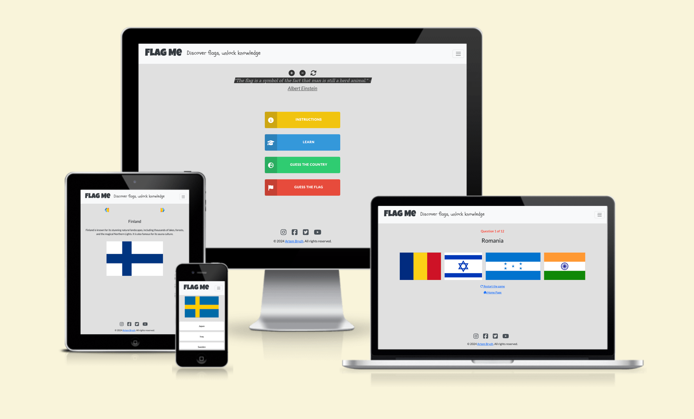
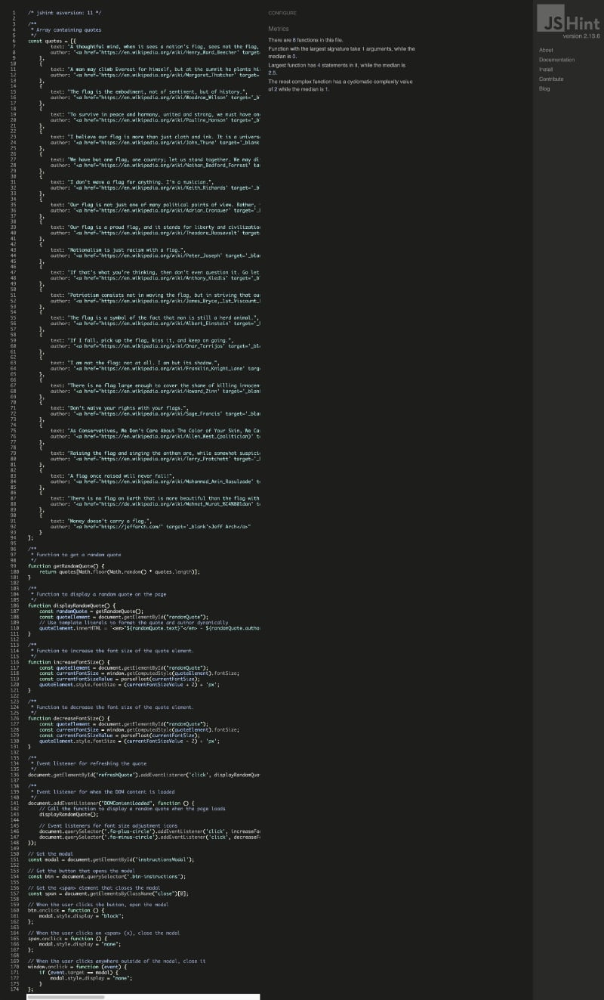

# Flag me README

View the live site [here](https://pagaslav.github.io/flag-me/)

## Introduction

The **FLAG ME** website is dedicated to making the learning of flags both easy and enjoyable. We offer a selection of games crafted to assist you in recognising and memorising flags from countries all around the world. As you play, you will inadvertently gain geographical insights. We stand by the belief that understanding the flags of the world should be both informative and fun, and our mission is to deliver a user-friendly platform that invites everyone to journey through the world via its flags.

## Project Goals

The **FLAG ME** website is designed to be a premier destination for flag enthusiasts and learners alike. Our objectives are outlined as follows:

1. **Interactive Learning:** To develop engaging games that make learning about flags from various countries straightforward and stimulating.
2. **Memory Enhancement:** To create a platform where users can easily learn and remember flags, which can also help improve their memory skills overall.
3. **Geographical Knowledge:** To provide a playful yet informative environment where users can inadvertently pick up geographical knowledge as they play.
4. **User-Friendly Design:** To ensure our website is easy to navigate so that users of all ages can enjoy learning about flags without any hassle.
5. **Cultural Exposure:** To facilitate a deeper understanding and appreciation for different countries and cultures through their flags.
6. **Community Building:** To foster a community of users who share a passion for flags and geography, encouraging interactions and exchanges of knowledge.

Our mission with these goals is to turn the task of learning about flags and geography into a delightful experience, making it accessible and entertaining for everyone.

## User Stories

### First Time Visitor Goals:

1. As a first-time visitor, I want to quickly understand what **FLAG ME** is all about so I can start having fun with flags and learning geography right away.
2. As a first-time visitor, I'm looking for an easy way to jump straight into games without any confusion, to ensure a hassle-free start.
3. As a first-time visitor, I hope to find a guide or tutorial on how to use the site and play the games, giving me a good first experience.

### Returning Visitor Goals:

1. As a returning visitor, I wish to see new flags or games that have been added since my last visit to keep things exciting and fresh.
2. As a returning visitor, I'm interested in tracking my progress and seeing how much I've learned over time.
3. As a returning visitor, I want to be able to quickly access my favorite games and see if there are any new challenges or levels.

### Frequent Visitor Goals:

1. As a frequent user, I want to check for any new features or games that have been added to **FLAG ME**, ensuring I'm up-to-date with the latest content.
2. As a frequent user, I'm interested in seeing if there are any new flag quizzes or learning tools that can further enhance my knowledge.
3. As a frequent user, I look forward to finding out if there have been updates or improvements to the site that might improve my experience and learning process.

## User Experience (UX) &
User Interface (UI)

### Wireframes

- Home Page
    
    

- Learn Page
    
    
    
- Guess the Flag Page
    
    
    
- Guess the Country Page
    
    
    
- Result Page
    
    
    
- Map of website
    
    
    
### Colour Scheme

#### Color Palette

- **Background for All Pages:** #e0e0e0 (Light Gray)
- **Logo Text:** #343a40 (Dark Charcoal)
- **Learn Button:** #3498db (Bright Blue)
- **Guess Country Button:** #2ecc71 (Vivid Green)
- **Guess Flag Button (Hover):** #c0392b (Crimson Red)
- **Social Icons:** #495057 (Slate Gray)
- **Social Icons Hover:** #007bff (Vivid Blue)

#### Color Psychology and Usage

- **#e0e0e0 (Light Gray) Background:** Provides a soft and soothing backdrop that complements vibrant interactive elements, ensuring comfortable viewing and minimizing visual strain.
- **#343a40 (Dark Charcoal) for Logo Text:** This deep, strong color for the logo text conveys reliability and sophistication, grounding the site’s branding with a stable and authoritative tone.
- **#3498db (Bright Blue) for Learn Button:** This shade of blue is energising and trustworthy, ideal for educational elements. It draws attention while also providing a sense of security and trust, encouraging users to start learning.
- **#2ecc71 (Vivid Green) for Guess Country Button:** Green is associated with growth and renewal. This lively shade is used for the "Guess Country" button to indicate action and promote engagement, signalling a start to new knowledge and discovery.
- **#c0392b (Crimson Red) for Guess Flag Button Hover:** Red is a color of passion and urgency, which makes it a perfect highlight for interactive elements like the Guess Flag button on hover. It grabs attention and indicates an area of immediate action.
- **#495057 (Slate Gray) for Social Icons:** Provides a subtle, professional appearance for social icons, ensuring they are visible without overpowering the layout. This color reflects balance and neutrality.
- **#007bff (Vivid Blue) for Social Icons Hover:** This brighter blue highlights the social icons on hover, enhancing user interaction by making the hover state clear and engaging.

#### Visual Harmony and Accessibility

This color palette was chosen to balance vibrancy with functionality, creating a visually appealing and accessible user experience. The use of distinct colors for interactive elements helps users navigate the site more intuitively, while the consistent use of blue tones across different elements strengthens the overall cohesive look of the site.

This color scheme is designed to support usability while also making the website aesthetically pleasing and aligned with its educational and interactive goals.

### Typography

#### Logo Font - Luckiest Guy

Luckiest Guy is a friendly, bold font that brings a lively feel to the site’s logo. Its playful and impactful style is perfect for catching the user's attention and making the brand name memorable.

- **Typeface:** 'Luckiest Guy', sans-serif
- **Usage:** This font is used for the logo text, which appears in the top left corner of every page. Its unique and fun design is essential for branding, making the logo stand out and providing a strong visual identity for the site.

#### Slogan Font - Schoolbell

Schoolbell is a casual, cursive font that exudes charm and informality. Its handwriting-like appearance adds a personal touch to the website.

- **Typeface:** 'Schoolbell', cursive
- **Usage:** Schoolbell is reserved for the site's slogan, displayed at the center of each page. It gives the slogan a distinctive, handcrafted feel, setting it apart from other textual content and giving it a friendly, inviting character.

#### Quote Font - Zilla Slab Highlight

Zilla Slab Highlight is a font with a strong personality, designed to emphasize key parts of a message. Its slab serifs and highlighted features are great for making important text pop.

- **Typeface:** 'Zilla Slab Highlight', serif
- **Usage:** This font decorates the quotes from famous individuals about flags featured at the top of the homepage. Its emphasis on certain strokes draws the eye and adds importance to the words, enhancing the impact of the quotes.

#### Button and Body Text Font - Lato

Lato is a versatile, modern sans-serif typeface that ensures excellent readability. It’s professional and friendly, ideal for web content.

- **Typeface:** 'Lato', sans-serif
- **Usage:** Lato is applied to button texts across all pages and for the main body text in articles and descriptions. Its clear and clean lines ensure that the text is easy to read, facilitating a seamless user experience.

#### Description Font on Learn Page - Lato

For descriptions on the learn.html page, Lato offers a consistent look with the rest of the site, while ensuring that the information is approachable and easy to digest.

- **Typeface:** 'Lato', sans-serif
- **Usage:** The same as above, Lato's readability and unobtrusive appearance make it an excellent choice for longer descriptions, ensuring that users can engage with the content comfortably.

The typographic choices for **FLAG ME**, featuring Luckiest Guy, Schoolbell, Zilla Slab Highlight, and Lato, establish a balanced and dynamic visual hierarchy, enhancing the user experience and reinforcing the site’s educational and interactive objectives. Each font is chosen for its readability, character, and ability to complement the others, creating a cohesive and attractive design.

### Flag Me Logo

"FLAG ME" in big, chunky letters catches your eye. They're written in a font called 'Luckiest Guy' which is super friendly and easy to like. It’s like the name of the site is saying, “Hey, let's have some fun!” It's like you're saying, “Here I am, ready to learn about a new place!” Plus, it's a fun way to start a conversation about where you've been or where you dream of going. The whole vibe is just laid-back and welcoming.

## Features

### Navigation

The navigation across the Flag Me website is thoughtfully structured to ensure a user-friendly and visually appealing interface, with a fixed navbar that remains accessible as you scroll. Below is a detailed description of the navigation elements you will encounter:

#### Navbar

##### Desktop View:

- **Positioning:** The navbar is fixed at the top of every page, ensuring continuous accessibility.
- **Logo and Slogan:** The Flag Me logo is prominently displayed on the left. Clicking on the logo either redirects to the home page or refreshes it. The slogan "Discover flags, unlock knowledge" is elegantly aligned to the left, enhancing the branding.
- **Hamburger Menu:** Located at the upper right corner, it expands to provide links to various pages:
    - **Home:** Directs users back to the homepage.
    - **Learn:** Leads to educational content about flags.
    - **Guess the Country:** Opens a game to identify countries based on their flags.
    - **Guess the Flag:** Challenges users to recognize flags from different countries.

This layout ensures that all site features are accessible and easy to navigate, enriching the user's experience.

**Desktop Navbar Image:**

**Desktop Navbar Image with the opened Hamburger Menu**

##### Responsive Design:

**Tablet View:**

- The navigation adapts for tablet devices, ensuring a user-friendly
layout.

**Tablet Navbar Image:**

**Tablet Navbar Image with the opened Hamburger Menu**

##### **Mobile View:**

- On mobile devices, the Flag Me website's navbar remains streamlined for optimal user experience. The logo is positioned on the left while the hamburger menu is on the right, maintaining easy access to all site features.
  
- The slogan is hidden on smaller screens to avoid clutter and enhance visibility, focusing on a clean and unobstructed interface.
  
- This design choice ensures that the navigation elements are not only accessible but also aesthetically pleasing, making efficient use of the limited screen space available on mobile devices.

**Mobile Navbar Image:**

**Mobile Navbar Image with the opened Hamburger Menu:**

### Footer

The footer of the website is elegantly designed to provide useful links and connect users with the social media platforms via icons provided by FontAwesome. This section includes:

- **Social Media Icons:** Prominently displayed to encourage engagement, these icons link to the website's various social media pages, enhancing the community feel. Connect with us on social media and stay updated on our latest offerings:
- **Instagram**: [Follow us in ](https://instagram.com/)
- **Facebook**: [Like our page](https://facebook.com/)
- **Twitter**: [Tweet with us](https://twitter.com/)
- **YouTube**: [Subscribe to our channel](https://youtube.com/)
  
- **Copyright Information:** The footer prominently features the copyright notice "Copyright: 2024 Artem Bryzh. All rights reserved." This not only protects the intellectual property but also establishes trust by clearly identifying the website's owner.
  
- **LinkedIn Connection:** A direct link to Artem Bryzh's LinkedIn profile is included, providing a professional touch and allowing visitors to connect or engage with him on a professional platform.

This footer layout ensures that while the user receives all necessary legal information and social links, the design remains clean and unobtrusive, complementing the overall user experience.

**Desktop Footer Image**

#### Responsive Design:

**Tablet and Mobile View:**

- **Consistent Appearance Across Devices:** Thanks to its minimalist design, the appearance of the footer remains consistent across tablet and mobile devices, ensuring a uniform user experience.

**Tablet Footer Image**

**Mobile Footer Image**

### Home Page

The "Flag Me" website's home page is designed for optimal user experience, offering both educational and interactive elements seamlessly integrated into its layout. Here’s what users can expect:

#### Quote Feature:

- **Inspirational Quotes**: Just below the navigation bar, the page features motivational quotes about flags from various historical figures.
- **Interactive Icons**: Users can adjust the text size of the quotes using FontAwesome icons (+ to increase, - to decrease) and refresh to see a new quote randomly selected from an array.

#### **Main Interactive Buttons:**

- **Instructions Button**: Provides guidelines on how to play the games, manage game sessions (exit or restart), and understand possible outcomes.
    
    
    
- **Learn Button**: Leads to a dedicated page for users to familiarise themselves with flags and their corresponding countries.

- **Guess the Country/Game Buttons**: Directs to games where users either identify the country from its flag or guess the flag based on the country's name.

Each element on the home page is thoughtfully placed to ensure a straightforward and engaging experience, inviting users to learn and test their knowledge about world flags in a visually appealing and user-friendly environment.

### Learn Page

The Learn page on the "Flag Me" website is thoughtfully designed to provide a seamless learning experience about different countries and their flags. The layout is simple and user-friendly, ensuring a high-quality user experience (UX).

#### Navigation Controls:

- **Arrows**: At the top, users find two arrow buttons allowing for easy navigation through the flags database—one to move to the previous flag and another for the next.

#### Content Layout:

- **Country Name and Facts**: Each country's name is prominently displayed at the center, followed by a brief snippet featuring intriguing facts, ensuring the content is both informative and digestible.
- **Flag Display**: Below the description, the country's flag is centrally showcased, set against a subtle grey background that enhances its colors, making it visually appealing and easy to identify.

This design strategy focuses on intuitive usability and aesthetic clarity, enhancing learning while making the page accessible and engaging. The contrast between the flags and the background also improves visibility, catering to good accessibility practices.

### Guess the Country Page

The "Guess the Country" page is thoughtfully designed for an optimal user experience in a flag recognition quiz format:

- **Question Indicator:** At the top of the page, there's a simple text line highlighted in red that displays the current question number and the total number of questions, helping players gauge their progress through the quiz.
- **Flag Display:** Beneath this indicator, the flag of a country is prominently displayed, setting the stage for the quiz.
- **Answer Options:** Below the flag, players find four clickable buttons that offer potential answers. These buttons are arranged two per row, ensuring that their position remains constant and predictable after each question due to standardized flag heights.
- **Interactive Links:** At the bottom, the 'Restart the Game' link prompts a confirmation dialog to prevent accidental restarts, enhancing thoughtful interaction. A 'Home Page' link is also provided, with similar confirmation steps to prevent unintended navigation, preserving the game session.
    
    
    
    
    
    
    

This configuration ensures that all elements are visually clear and consistently placed, minimising user effort and maximising accessibility and engagement.

### Guess the Flag Page

Our "Guess the Flag" page is intuitively designed to enrich your gaming experience. Here’s what you can expect:

- **Progress Tracker:** At the very top of the page, there’s a prominently displayed counter in red, showing which question you’re on and how many are left. This feature helps you gauge your progress throughout the game.
- **Flag Challenge:** Below the tracker, the name of the country you need to match the flag with is clearly displayed. This is followed by four flag images. These represent your multiple-choice options. The flags are neatly aligned, making your choice straightforward and error-free.
- **Convenient Navigation:** At the bottom, there’s a 'Restart the Game' link equipped with a confirmation prompt to prevent accidental restarts. A separate link to return to the 'Home Page' ensures you can easily navigate away without disrupting your game session, with a prompt to confirm your decision.
    
    
    
    
    
    
    

These elements combine to create a seamless and user-friendly interface, ensuring the focus remains on enjoying the quiz and learning flags. The design is clean and minimalistic, emphasizing functionality and ease of use, enhancing both engagement and accessibility.

### Result Page

Our "Result Page" celebrates your effort and achievement after completing the quiz:

- **Congratulations Message:** A welcoming note at the top congratulates you on finishing the quiz, setting a positive tone.
- **Score Display:** Directly below, your score is highlighted in red, clearly stating how many points you've scored.
- **Motivational Quote:** Further enhancing the page, there's a playful, supportive quote from Dr. Sheldon Cooper of "The Big Bang Theory," humorously encouraging further exploration of flags.
- **Answer Ranges:**
    - Less than 4 correct answers: Encouragement to try again and improve.
        
        
        
    - 4-7 correct answers: Recognition of a good attempt.
        
        
        
    - 8-11 correct answers: Commendation for an impressive score.
        
        
        
    - All 12 correct answers: Praise for a perfect score.
        
        
        
- **Convenient Navigation:** At the bottom of the page, links to 'Home Page' and 'Play Again.
    
    
    

This design strategy focuses on user engagement and satisfaction, making the results page not only informative but also supportive and motivating, ensuring a positive user experience throughout.

## Technologies Used

- [HTML](https://developer.mozilla.org/en-US/docs/Web/HTML) was used as the foundation of the site.
- [CSS](https://developer.mozilla.org/en-US/docs/Web/css) - was used to add the styles and layout of the site.
- [Bootstrap](https://getbootstrap.com/docs/5.3) was employed to integrate its styles, facilitating rapid development and
consistent styling across the pages.
- [JavaScript](https://developer.mozilla.org/en-US/docs/Web/JavaScript) was employed to implement dynamic interactions on the site, enabling real-time user feedback and interactive features without needing to reload the page.
- [VSCode](https://code.visualstudio.com/) was used as the main tool to write and edit code.
- [Git](https://git-scm.com/) was used for the version control of the website.
- [GitHub](https://github.com/) was used to host the code of the website.
- [GitHub Pages](https://pages.github.com/) was used for hosting the deployed front-end site.
- [Balsamiq](https://balsamiq.com/) was used to make wireframes for the website.
- [Adobe Photoshop](https://www.adobe.com/uk/products/photoshop.html) was used to make and resize images for the website and the
README file.
- [ICO Converter](https://www.icoconverter.com/) - for the favicon.
- [Chrome Developer Tools](https://developer.chrome.com/docs/devtools/) - was used to debug, to test responsiveness and generate Lighthouse reports.
- [Google Fonts](https://fonts.google.com/) - to import the site font.
- [Font Awesome](https://fontawesome.com/) - for all the site icons.
- [W3C HTML Validator](https://validator.w3.org/) - to test HTML code.
- [W3C CSS Validator](https://jigsaw.w3.org/css-validator) - to test the CSS code.
- [JSHint](https://jshint.com/) is a tool used to detect errors and potential problems in JavaScript code,
- [Notion](https://www.notion.so/) was used for online drafting of the README file. The content was then exported and integrated into the project for completion.

## Testing

### Responsiveness

The functionality of the links in the website was checked as well by
different users. The website was checked by extension
“**Responsive Viewer**” in Chrome.

Screen sizes

- **Home page**

- **Home page with the Instruction window**

- **Learn page**
    
    

- **Guess the country page**

- **Guess the flag page**
    
    

- **Result page**

### Validator testing

#### HTML

- **Home page**
    
    

When I tested the homepage using the [validator.w3.org](http://validator.w3.org/) service, it initially found seven errors. I fixed all of them, and a retest showed zero errors. Here's a screenshot proving the clean results.

- **Learn page**
    
    
    

The validator flagged an error on the learning page stating that the image element had an empty 'src' attribute. However, this is not a practical issue because JavaScript dynamically populates the 'src' attribute during the user's interaction with the page. This ensures that while the initial HTML might show an empty 'src', it is filled with the appropriate content as soon as the page is used. A screenshot from the live site demonstrates that during actual usage, all necessary image data is correctly loaded by JavaScript.

- **Guess the country page**
    
    
    

Similarly, the "Guess the Country" game page has the same issue flagged by the validator regarding the image element having an empty 'src' attribute. This is also not a concern in practice because JavaScript dynamically fills in these attributes during gameplay. This ensures the images are correctly displayed when needed, as the game interacts with user inputs to load and display the corresponding flag images.

- **Guess the flag page**
    
    
    

On the "Guess the Flag" game page, I found three issues, similar to previous scenarios. After adding a missing closing div tag, one issue remained.

This remaining issue is not a real error, as the country name is dynamically inserted when the page loads through a JavaScript function. Like in the other game pages, this setup ensures that all necessary data is correctly populated during user interaction, demonstrating that the HTML validator's error doesn't impact the actual functionality or user experience of the page.

- **Result page**

No errors or warnings were found when passing through the official
W3C validator.

#### CSS

No errors or warnings were found when passing through the official
W3C validator.

#### JavaScript

I have used the recommended [JShint Validator](https://jshint.com/) to validate all of my JS files.

**quotes.js**

assets/js/quotes.js

**learn.js**

assets/js/learn.js

**guess-the-country.js**

assets/js/guess-the-country.js

**guess-the-flag.js**

assets/js/guess-the-flag.js

**result.js**

assets/js/result.js

Although JSHint flagged "playAgain" as an unused variable on line 84, it's actually a function intended for restarting the game after displaying the result. It's used to allow the user to restart the game after completion, depending on the current game type.

Validating "flags-data.js" with JSHint is unnecessary since it only contains an array of flag objects. It includes properties such as "image" for the flag image path, "country" for the country name, "description" for information about the country, and "difficulty" to indicate the level of difficulty associated with the flag.

### LightHouse report

- Using lighthouse in devtools I confirmed that the website is
performing well, with great SEO, accessible and colours and fonts chosen
are readable.

**Home page**

Desktop:

Mobile:

**Learn page**

Desktop:

Mobile:

**Guess the country page**

Desktop:

Mobile:

**Guess the flag page**

Desktop:

Mobile:

**Result page**

Desktop:

Mobile:

### Compatibility

In order to confirm the correct functionality, responsiveness, and
appearance:

- The website was tested on the following browsers: Chrome, Firefox,
Safari.

| Browser tested | Intended appearance | Intended responsiveness |
| --- | --- | --- |
| Chrome | Good | Good |
| FireFox | Good | Good |
| Safari | Good | Good |
- **Chrome**

- **Firefox**
    
    

- **Safari**
    
    

### Manual testing

| feature | test case | expected result | tested | passed | comments |
| --- | --- | --- | --- | --- | --- |
| Navbar |  |  |  |  |  |
| Logo | Click on the Logo on each page | The user is redirected to the Home page | Yes | Yes | When clicking on any link on the game pages, a pop-up window appears, requiring confirmation of your choice. |
| Hamburger menu | Click on the Hamburger menu on each page | The navigation menu is successfully displayed | Yes | Yes |  |
| Home Page Link Functionality | Click on the Home Page Link on each page | The user is redirected to the home page. | Yes | Yes | When clicking on any link on the game pages, a pop-up window appears, requiring confirmation of your choice. |
| Learn Link Functionality | Click on the “Learn” link on each page | The user is redirected to the Learn page | Yes | Yes | When clicking on any link on the game pages, a pop-up window appears, requiring confirmation of your choice. |
| Guess the country Link Functionality | Click on the “Guess the country” link on each page | The user is redirected to the Guess the country page | Yes | Yes | When clicking on any link on the game pages, a pop-up window appears, requiring confirmation of your choice. |
| Guess the flag Link Functionality | Click on the “Guess the flag” link on each page | The user is redirected to the Guess the flag page | Yes | Yes | When clicking on any link on the game pages, a pop-up window appears, requiring confirmation of your choice. |
| Footer |  |  |  |  |  |
| Instagram icon in the footer | Click on the Instagram icon | The user is redirected to the Instagram page in a new window | Yes | Yes | Confirm that a hover effect is triggered, and the colour of the icon
of social-media changes. |
| Facebook icon in the footer | Click on the Facebook icon | The user is redirected to the Facebook page in a new window | Yes | Yes | Confirm that a hover effect is triggered, and the colour of the icon
of social-media changes. |
| Twitter icon in the footer | Click on the Twitter icon | The user is redirected to the Twitter page in a new window | Yes | Yes | Confirm that a hover effect is triggered, and the colour of the icon
of social-media changes. |
| YouTube icon in the footer | Click on the YouTube icon | The user is redirected to the YouTube page in a new window | Yes | Yes | Confirm that a hover effect is triggered, and the colour of the icon
of social-media changes. |
| Artem Bryzh link | Click on the author’s name link. | Open the LinkedIn profile of the developer in a new window | Yes | Yes | Confirm that a hover effect is triggered |
| Home page |  |  |  |  |  |
| Increase Font Size with Plus Icon | Click on the plus icon to increase the font size | The font size is increased. | Yes | Yes |  |
| Decrease Font Size with Minus Icon | Click on the minus icon to decrease the font size | The font size is decreased. | Yes | Yes |  |
| Refresh Quote with Refresh Icon | Click on the refresh icon to load the next random quote | The next random quote is displayed. | Yes | Yes |  |
| Instructions Button Functionality | Click on the "Instructions" button to open the instructions modal |  The instructions modal appears on the screen. | Yes | Yes |  |
| Learn Button Functionality | Click on the Learn Button | The user is redirected to the "Learn" page | Yes | Yes |  |
| Guess the Country Button Functionality | Click on the Guess the Country Button | User redirected to "Guess the Country" page. | Yes | Yes |  |
| Guess the Flag Button Functionality | Click on the Guess the Flag Button | User redirected to the "Guess the Flag" page. | Yes | Yes |  |
| Learn Page |  |  |  |  |  |
| Back Arrow Functionality  | Click on the Back Arrow | User is navigated to the previous flag. | Yes | Yes |  |
| Forward Arrow Functionality | Click on the Forward Arrow | User is navigated to the next flag. | Yes | Yes |  |
| Guess the Country Page |  |  |  |  |  |
| Mouse Pointer Change on Hover | Hover over any of the four option buttons | The mouse pointer changes to a hand with a pointing finger (pointer). | Yes | Yes |  |
| Loading Next Flag and Country Options | Click on any of the option buttons | The next flag and new country options are loaded. | Yes | Yes | The buttons remain in place. |
| Restart the Game Link | Hover over the "Restart the game" link | The link has a hover effect, indicating its interactivity.  | Yes | Yes |  |
| Restart the Game Link | Click on the "Restart the game" link | Upon clicking the link, a confirmation popup appears, prompting the user to confirm their choice. | Yes | Yes |  |
| Confirm Restart | Click on the "OK" button in the confirmation popup. | The game restarts from the beginning. | Yes | Yes |  |
| Cancel Restart | Click on the "Cancel" button in the confirmation popup. | The user remains on the current game without any changes. | Yes | Yes |  |
| Home Page Link | Hover over the "Restart the game" link | The link has a hover effect, indicating its interactivity.  | Yes | Yes |  |
| Home Page Link | Click on the "Home Page" link | Upon clicking the link, a confirmation popup appears, prompting the user to confirm their choice. | Yes | Yes |  |
| Confirm Redirecting | Click on the "OK" button in the confirmation popup. | The user is redirected to the Home page | Yes | Yes |  |
| Cancel Redirecting | Click on the "Cancel" button in the confirmation popup. | The user remains on the current game without any changes. | Yes | Yes |  |
| Guess the Flag Page |  |  |  |  |  |
| Mouse Pointer Change on Hover | Hover over any of the four  flags | The mouse pointer changes to a hand with a pointing finger (pointer). | Yes | Yes |  |
| Guess the Flag by Country Page Functionality | Click on one of the flags. | The page loads the next country and presents four new flags for the user to guess. | Yes | Yes |  |
| Restart the Game Link | Hover over the "Restart the game" link | The link has a hover effect, indicating its interactivity.  | Yes | Yes |  |
| Restart the Game Link | Click on the "Restart the game" link | Upon clicking the link, a confirmation popup appears, prompting the user to confirm their choice. | Yes | Yes |  |
| Confirm Restart | Click on the "OK" button in the confirmation popup. | The game restarts from the beginning. | Yes | Yes |  |
| Cancel Restart | Click on the "Cancel" button in the confirmation popup. | The user remains on the current game without any changes. | Yes | Yes |  |
| Home Page Link | Hover over the "Restart the game" link | The link has a hover effect, indicating its interactivity.  | Yes | Yes |  |
| Home Page Link | Click on the "Home Page" link | Upon clicking the link, a confirmation popup appears, prompting the user to confirm their choice. | Yes | Yes |  |
| Confirm Redirecting | Click on the "OK" button in the confirmation popup. | The user is redirected to the Home page | Yes | Yes |  |
| Cancel Redirecting | Click on the "Cancel" button in the confirmation popup. | The user remains on the current game without any changes. | Yes | Yes |  |
| Result Page |  |  |  |  |  |
| Home Page Link | Hover over the "Home Page" link | The link has a hover effect, indicating its interactivity.  | Yes | Yes |  |
| Home Page Link Functionality | Click on the Home Page Link on each page | The user is redirected to the home page. | Yes | Yes |  |
| Play Again Link | Hover over the "Play Again" link | The link has a hover effect, indicating its interactivity.  | Yes | Yes |  |
| Play Again Link Functionality | Click on the "Play Again" button. | The user starts the same game again. | Yes | Yes |  |
|  |  |  |  |  |  |

### Bugs

**learn.js**

assets/js/learn.js

**Duplicate Image Source Assignment:** The flag image source (**`src`**) was set twice in succession, which could lead to redundant operations or potential confusion in maintenance.

**Solution:** Remove the duplicate line to streamline the code and prevent any possible conflicts or performance issues.

The function **`showPreviousFlag()`** initially allowed the **`currentIndex`** to go negative if it was called when the **`currentIndex`** was **`0`**. This caused an out-of-bounds error when attempting to access the **`flagsDataArray`**.

**Solution Applied:** Revised the calculation for **`currentIndex`** to use modulo operation, ensuring that the wrap-around is handled more efficiently and preventing any negative indices. This modification ensures that **`currentIndex`** remains within the valid range, preventing errors and improving the robustness of the navigation through the flag array.

**guess-the-country.js**

assets/js/guess-the-country.js

Initially, the **`generateQuestionsArray`** function had a bug where it could sometimes add duplicate countries as options for a single question. This was because the check to prevent duplication only occurred within the same question and did not consider the entire set of selected flags.

**Solution Applied:**

To ensure uniqueness across the entire set of questions and options, a global set of used countries was implemented. This prevented the repeated use of the same country within different questions' options. 

This approach effectively resolves the issue by ensuring that each question's options are unique not only within themselves but also across the quiz, enhancing the quiz's quality and challenge.

### Unsolved Bugs

To the best of my knowledge, there are no unresolved bugs at the
moment.

### Mistakes

- Initially, failed to document encountered bugs promptly during the
coding process.
- Realised the importance of documenting bugs in real-time for better
tracking and resolution.
- In future projects, I commit to maintaining a detailed log of
encountered bugs and their resolution steps throughout the development
process.
- Initially, I attempted to implement automated tests using Jest. However, I realized that it would require much more time than I have left before the project deadline (which is tomorrow!). Therefore, I have decided to postpone this feature to my future projects.

## Deployment

### Deployment to GitHub Pages

- The site was deployed to GitHub pages. The steps to deploy are as
follows:
    - In the [GitHub repository](https://github.com/pagaslav/flag-me), navigate to the Settings tab
    - From the source section drop-down menu, select
    the **Main** Branch, then click “Save”.
    - The page will be automatically refreshed with a detailed ribbon
    display to indicate the successful deployment.

The live link can be found [here](https://pagaslav.github.io/flag-me/)

### Local Deployment

In order to make a local copy of this project, you can clone it. In
your IDE Terminal, type the following command to clone my
repository:

- `git clone https://github.com/pagaslav/flag-me.git`

## Credits

### Content

1. **Flag’s images:**
    
    I took flag images from [Flagpedia.net](https://flagpedia.net/)
    
2. **General Information:**
    - Additional information about countries is
    referenced from [Wikipedia](https://en.wikipedia.org/).

3. **Some design:**
    - The design of the buttons on the main page was [borrowed](https://codepen.io/andrea-maselli.) but extensively modified to fit my project.

## Acknowledgments

- [Code Institute](https://codeinstitute.net/) tutors and Slack community members for their support and help.
  
- My daughter for her longstanding love of flags and all things related to them.
  
- [Kevin Powell](https://www.youtube.com/user/KepowOb) for his amazing CSS tutorials.
  
- A heartfelt thank you to the creators of [Bootstrap](https://getbootstrap.com/) for providing an
excellent style framework. Their toolkit not only accelerates the
development process but also empowers beginners to exceed their own
capabilities.

## Future Improvements

1. **Add more flags:** Expand the collection of flags to include more countries.
2. **Enhance interactivity:** Incorporate sound effects when buttons are clicked.
3. **Visual feedback in games:** Implement highlighting of incorrect answers in red and correct answers in green to provide immediate feedback to the user during gameplay.
4. **Review of incorrect answers:** Provide a link on the results page where users can review the questions they answered incorrectly and practice those specific flags or country associations.
5. **Voice narration:** Introduce voice narration for text content and flag descriptions on the learning page to enhance accessibility and cater to users with different needs.
6. **Include historical context:** Add information about the history and symbolism of flags, explaining the meaning behind their colors and symbols.
7. **Difficulty levels:** Introduce a feature to allow users to select the difficulty level before starting the game, offering options such as easy, medium, and hard.